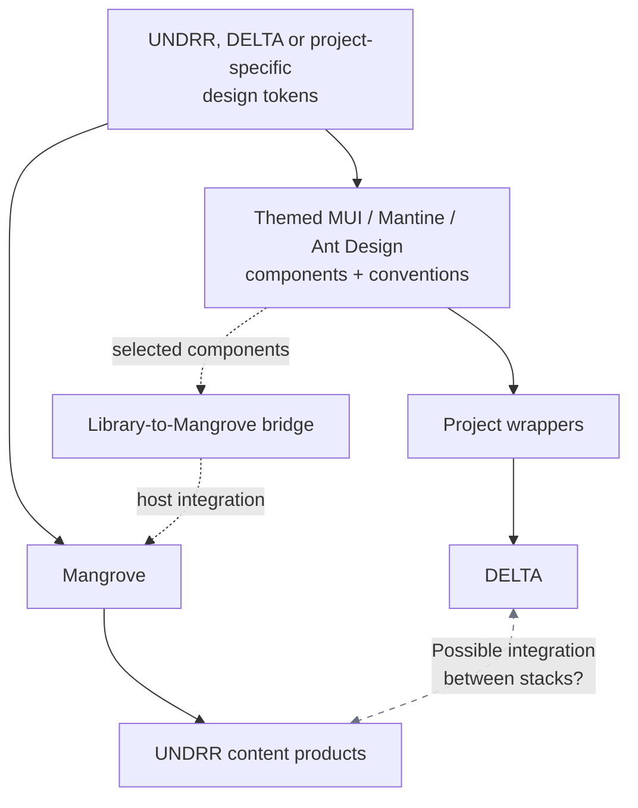
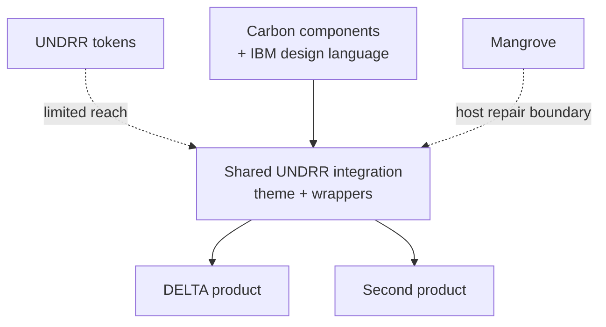
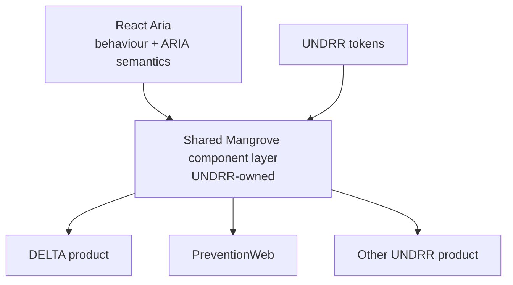

# Architecture options — what adopting each candidate does to design system cohesion at UNDRR

The strategic argument is hand-written; the reuse comparison is generated from
`reuse-results.json`. Every number is traceable to [scores.md](./scores.md),
[axes.md](./axes.md), the reuse record or a candidate's `evidence.json`. UNDRR can
reject the argument without changing the measurements beneath it.

## The question a component inventory cannot ask

[comparison.md](./comparison.md) records 300 assessments and finds that all five
candidates cover DELTA's components. That is a real result and a useless one for
choosing between them, because every serious React library ships buttons, inputs,
selects and tables. It discriminates between nothing.

The wizard changes that. PrimeReact — the incumbent being replaced — ships
`Stepper`, and DELTA's add-disaster-event screen uses one, so a step indicator is
not a nice-to-have on this estate: it is existing functionality that has to
survive the migration. Four candidates ship a stepper of their own. React Aria
ships nothing of the kind, and the demo has to build one.

The instinct is to score that as a gap. It is more useful as a different
question:

> **How many components does Mangrove end up owning under each candidate?**

That is a headcount question, it survives contact with a budget, and it has
different answers per candidate in a way that "does it have a stepper" does not.

## What UNDRR is choosing

This is not a choice between a library that can be shared and one that cannot.
**Every candidate can sit below a UNDRR-owned wrapper package.** The question is
what it costs to make Mangrove, rather than the library, the enduring product
layer: who owns the visual language, which changes are inherited by a second
product, and how much host-specific repair accumulates as the estate grows.

| Decision lens | The evidence needs to answer |
| --- | --- |
| **Product ownership** | Does a product inherit a governed UNDRR component and interaction policy, or a locally configured library component? |
| **Reuse at the second product** | After DELTA builds a capability, what can another product import unchanged? |
| **Visual sovereignty** | Can UNDRR change tokens, density, layout and interaction expression centrally, or does the library's design language remain the effective authority? |
| **Host resilience** | When Mangrove changes, does the shared layer absorb the change or does every product need a repair? |

Accessibility and RTL remain adoption gates: no option is acceptable without a
human keyboard and screen-reader pass, and Arabic must not depend on a fragile or
unaccepted setup. They are not, by themselves, the strategic choice between the
operating models below.

### What is proved, and what is proposed

| Claim | Status in this evaluation |
| --- | --- |
| Every candidate implements the evaluated screens | **Proved** by the requirement run |
| MUI can share a substantial integration layer across both hosts | **Measured** by `packages/integration-mui` |
| React Aria has clean containment on both hosts and live token propagation | **Proved** by leakage and theming assertions |
| A Mangrove-owned React Aria records layer can be reused across hosts | **Measured** by `packages/integration-react-aria` and `reuse-results.json` |
| That layer can cover the whole estate's component inventory | **Proposed architecture** — one realistic capability is evidence, not the completed design system |
| A component suite necessarily creates per-site bespoke work | **Not proved** — this depends on wrapper architecture and governance, not the package alone |

## Three shapes, not five

### A. Ship-and-theme — MUI, Mantine, Ant Design

This route creates two parallel delivery paths using the same token mechanism,
not necessarily the same visual theme. Mangrove can carry UNDRR defaults into
content products, while DELTA or another project supplies its own palette,
typography and other brand values. The relevant token set themes the component
suite directly; project wrappers then compose those themed components for the
application. The suite still brings its own component structure and conventions.

**What you get.** Components you do not maintain, including the accessibility
work. A stepper, a data grid and a date picker arrive free and stay maintained by
someone else. DELTA can use that suite through shared wrappers and its own token
set, while content products continue to inherit Mangrove.

**What it costs.** The two paths do not become one system merely because both are
token-driven. **The question-mark line is the main cohesion risk:** DELTA and the
content estate use different component pipelines, so moving a capability or
pattern in either direction requires translation rather than simple reuse. If
the two paths evolve independently, their components, interaction policy and
visual conventions can desynchronise.

The dotted library-to-Mangrove route is a separately owned bridge: wrappers,
stylesheet ordering and host repair that make selected suite components usable
inside Mangrove and therefore available to content products. Ant Design's blank
filter labels and MUI's Arabic defect both live at this kind of boundary. The MUI
extraction proves the application-side package can be shared; it does not prove
that the package and Mangrove form one coherent component system without the
bridge work.

### B. Complete branded system — IBM Carbon

Structurally the same as A, but the library is not neutral. Carbon is a *product*
design system: it ships a full component set and also IBM's design language —
Plex typography, IBM's colour ramps, its own grid and spacing scale.

Calling this "the middle" is right, but not because it is more foundational than
MUI — it is *less* neutral. The middle position is that it is as complete as A
while being harder to make look like UNDRR. This evaluation hit that directly:
Carbon's font stacks are Sass values that `@carbon/styles/scss/type` re-forwards
without exposing, so **the font family cannot be set through the supported API**
and had to be reached another way. It happens not to matter, because 56 of
Carbon's 67 `font-family` declarations are `inherit` — but "we got lucky about the
shape of their Sass" is not a theming strategy.

### C. Foundational — Adobe React Aria

React Aria ships behaviour and semantics, not appearance. There is no theme layer
to configure because there is nothing to theme.

Note what changed: **there is no dotted line.** Mangrove is not injected from the
side, it *is* the component layer. This is not a workaround for React Aria's
missing stepper — it is React Aria's intended architecture. Adobe expects you to
build the components; that is the product.

The diagrams now hold architecture constant: all three routes may use one shared
UNDRR package. What changes is the authority inside that package. Under A and B,
the package configures and repairs a component system whose structure and design
language remain upstream. Under C, the package owns the component expression and
uses the upstream library for behaviour and semantics.

## Supporting case study: the wizard

The wizard is useful evidence that a shipped component does not remove UNDRR's
semantic ownership: all five implementations needed application-level decisions
about the current step. Its detailed MUI semantics, support data and CSS counts
are retained in [the Stepper case study](./case-study-stepper.html), rather than
carrying the main architecture argument.

## The reusability argument, and what has to be true for it

The case for shape C is the one worth making to UNDRR, and it is not
"React Aria scored highest":

**The libraries in shapes A and B give you more at the first product.** They can
also be put behind a shared UNDRR wrapper; the MUI extraction demonstrates that.
The unresolved question is whether the wrapper becomes the authority in practice,
or whether each product continues to negotiate with the library's theme,
conventions and host collisions. Shape C makes the intended authority explicit:
the component is built once in Mangrove and every consuming product receives the
same policy. Where a gap exists, filling it is deliberately shared work rather
than local work.

That is the strategic reading, and this evaluation's evidence is consistent with
it: React Aria is the only candidate that stays inside its own subtree on both
hosts, and Arabic works from a `dir` attribute alone. A library with no opinions
cannot conflict with Mangrove — which is also, honestly, why three of the seven
axes reward it.

**Four operating conditions still have to be accepted.** The records extraction
now checks that a shared layer is technically real; it does not fund or govern it.

1. **The component layer gets funded and staffed.** The stepper in
   `apps/delta-react-aria/src/views/EventWizard.tsx` is the price tag for one
   component on one screen: the markup, the states, the connector, the
   number-to-check swap, `aria-current="step"`, a live region, and roughly 180
   lines of CSS. Multiply by DELTA's component inventory. Shape C is
   *adopt this and fund a design system*, not *adopt this and save work*.
2. **Mangrove takes on the accessibility ownership.** Under A and B, when a
   library fixes a keyboard trap in its stepper, you get the fix. Under C, you are
   the one who has to notice. React Aria carries the ARIA plumbing, which is most
   of the risk — but not the composition.
3. **The `owner` field has to stay honest.** Today a defect owned by a candidate
   scores against that candidate; a host defect scores against nobody. A
   Mangrove-owned stepper reclassifies its defects as UNDRR's, which makes the
   composite look better while the work is unchanged — just relocated onto your
   team. If shape C is adopted, that reclassification must be visible, not
   silent.
4. **Shared does not mean uniform.** A stepper is visually prominent, not a
   primitive. A Mangrove component has to inherit focus ring, density, spacing
   and RTL behaviour from whatever surrounds it, or it looks foreign. Under shape
   C there is only one surrounding context, which is exactly why the shape is
   coherent — and why mixing C with A on the same page is the worst of both.

## The reuse and ownership result

The experiment now tests the architecture for the two leading contrasting
models, React Aria and MUI:

1. The realistic React Aria records workspace moved into
   `packages/integration-react-aria`: 618 non-comment TypeScript lines and 147
   CSS lines, consumed by both hosts.
2. The existing MUI extraction remains the component-suite comparison: 809
   shared lines and 86% shared when evaluation-only side-by-side code is removed.
3. Token, interaction-policy and RTL/localisation changes were traced through
   both arrangements. The generated comparison below reads
   `docs/reuse-results.json`.

The line counts prove that both approaches package; they do not select a winner.
The differentiator is propagation and authority. React Aria retains live token
references and gives the shared layer control of records layout. MUI centralises
wrappers and theme mapping successfully, but each site must rebuild for token
changes and the library retains structural choices such as physical RTL offsets.

## What this does not settle

The measured React Aria package corrects A3 from an analysed result to a packaged
one, which raises its composite; the line count itself is not a new scoring axis.
The three decisions in [scores.md](./scores.md) still stand: run a human
accessibility pass, ratify the rule that currently excludes MUI, and decide
whether UNDRR will fund and govern the shared component layer. If shape C is
chosen, it should be chosen *for the reuse*, with that staffing named — and not
because a stepper was missing.
