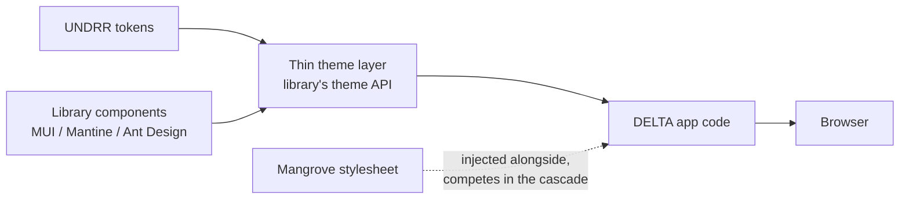
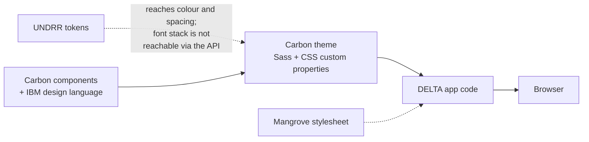
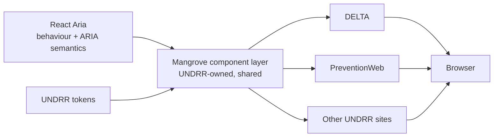

# Architecture options — what adopting each candidate does to Mangrove

HAND-WRITTEN. This is a framing for a decision, not a measurement, and it is kept
out of the generated pages for that reason. Every number quoted here is traceable
to [scores.md](./scores.md), [axes.md](./axes.md) or a candidate's
`evidence.json`; the argument built on top of them is the author's, and UNDRR is
free to reject it without touching a single score.

## The question a component inventory cannot ask

[comparison.md](./comparison.md) records 300 assessments and finds that all five
candidates cover DELTA's components. That is a real result and a useless one for
choosing between them, because every serious React library ships buttons, inputs,
selects and tables. It discriminates between nothing.

The wizard changes that. PrimeReact — the incumbent being replaced — ships
`Stepper`, and DELTA's add-disaster-event screen uses one, so a step indicator is
not a nice-to-have on this estate: it is existing functionality that has to
survive the migration. Four candidates ship a stepper of their own. React Aria
ships nothing of the kind, and the demo has to build one.

The instinct is to score that as a gap. It is more useful as a different
question:

> **How many components does Mangrove end up owning under each candidate?**

That is a headcount question, it survives contact with a budget, and it has
different answers per candidate in a way that "does it have a stepper" does not.

## Three shapes, not five

### A. Ship-and-theme — MUI, Mantine, Ant Design

The library owns the components. You configure a theme, you consume the
components, and Mangrove arrives from the side: its stylesheet loads alongside,
and its tokens feed the theme object where the library's API allows.

**What you get.** Components you do not maintain, including the accessibility
work. A stepper, a data grid and a date picker arrive free and stay maintained by
someone else.

**What it costs.** The dotted line is the problem, and it is what A4 measures.
Mangrove is not integrated here — it is *adjacent*, arriving as CSS that competes
with the library's own in the same cascade. Ant Design's blank filter labels and
MUI's Arabic defect both live on that line. And each site that adopts this shape
re-does its own theme mapping: the theme layer is thin, but there is one per site,
and they drift.

### B. Complete branded system — IBM Carbon

Structurally the same as A, but the library is not neutral. Carbon is a *product*
design system: it ships a full component set and also IBM's design language —
Plex typography, IBM's colour ramps, its own grid and spacing scale.

Calling this "the middle" is right, but not because it is more foundational than
MUI — it is *less* neutral. The middle position is that it is as complete as A
while being harder to make look like UNDRR. This evaluation hit that directly:
Carbon's font stacks are Sass values that `@carbon/styles/scss/type` re-forwards
without exposing, so **the font family cannot be set through the supported API**
and had to be reached another way. It happens not to matter, because 56 of
Carbon's 67 `font-family` declarations are `inherit` — but "we got lucky about the
shape of their Sass" is not a theming strategy.

### C. Foundational — Adobe React Aria

React Aria ships behaviour and semantics, not appearance. There is no theme layer
to configure because there is nothing to theme.

Note what changed: **there is no dotted line.** Mangrove is not injected from the
side, it *is* the component layer. This is not a workaround for React Aria's
missing stepper — it is React Aria's intended architecture. Adobe expects you to
build the components; that is the product.

## What the wizard actually measured

One screen, built five times, and the result inverts the question. **Four
candidates ship a stepper. None of them marks the current step in the
accessibility tree.** All five demos hand-write `aria-current="step"` — the four
with a real component to use included.

| Candidate | Stepper? | What it emits for "current" | Hand-written style |
| --- | --- | --- | --- |
| Mantine | `Stepper` | `data-progress="true"` — a data attribute | **0 rules** |
| Ant Design | `Steps` | a CSS class; a disabled step gets no role at all | 1 rule |
| IBM Carbon | `ProgressIndicator` | hidden English text "Current", folded into the accessible name | 14 rules |
| MUI | `Stepper` | `aria-selected` — the *wrong* state, see below | 0 rules, 2 `sx` repairs |
| React Aria | **none** | nothing to emit; the component is yours | **26 rules, 221 lines** |

Counts are every hand-written CSS rule for the whole wizard, review cards
included, so they compare like with like. Three of Carbon's fourteen reach into
`.cds--` internals rather than its theming API, which is the more expensive kind.
MUI writes no stylesheet at all — it uses `sx` throughout, as that demo does
everywhere — so its number is the two `sx` blocks that exist to *repair* the
component, not the twelve doing ordinary layout.

**MUI does not merely omit it — it asserts something false.** `Stepper` sniffs its
children, finds `StepButton`, and silently switches into tab-list mode:
`role="tablist"` on the root, `role="tab"` + `aria-selected` +
`aria-posinset`/`aria-setsize` on each step, and `role="presentation"` on the list
items. There is no opt-out prop. A tab set tells a screen-reader user the panels
are peers they may visit in any order, in a form that gates them. Six attributes
are overridden by hand — and only because both components spread `...other` after
their own `role`, which is an accident of implementation, not an extension point.
The roving tab index installed by the same flag cannot be removed at all.

**And this is a position, not a bug — one MUI argued itself into.** v5 through v7
emitted `aria-current="step"`, the value this document calls correct. PR
[#47687](https://github.com/mui/material-ui/pull/47687), merged 12 March 2026 and
shipped in v9.0.0, replaced it; the
[v9 migration guide](https://mui.com/material-ui/migration/upgrade-to-v9/) lists
*"the `aria-current` changed to `aria-selected`"* among a set of accessibility
improvements, and the change does fix two real complaints that the stepper
announced too little.

The part worth reading is the thread. On issue
[#43689](https://github.com/mui/material-ui/issues/43689), 27 January 2026, a MUI
maintainer asked of the proposal:

> Wouldn't it be a bit odd if Stepper provides all the `tab` roles except
> `tabpanel`?

The PR's own author agreed the same day:

> I'm currently hesitant in turning the stepper into a tab list. I think the
> ordered list markup, combined with the `aria-current` and step buttons pointing
> to the content area is enough.

**That is the last human comment on the thread.** Two weeks later a commit titled
`refactor as tablist` landed; the issue was closed by a bot on merge. A second
reviewer raised the same doubt inside the PR — *"Since this isn't a tablist, I'm
not sure"* — and got an answer about keyboard mechanics, not about the role. No
public rationale for the reversal exists in the PR, the issue, the commit
messages or any RFC.

So the objection in this document is not an outside opinion MUI has never heard.
It is MUI's own, raised twice, conceded once, and then shipped past without being
answered.

**Nobody outside MUI has filed against it, and there is a reason.** Four months
after release, v9 is **11.4% of `@mui/material` installs**; v5 — which emits
`aria-current="step"` — is still 40%. MUI's screen-reader/browser test matrix was
drafted a month *after* v9.0.0 and does not include Stepper. And their axe CI
asserts on two rules only (`color-contrast`, `link-in-text-block`), which would
not catch this even if it asserted on everything: `ol[role=tablist] >
li[role=presentation] > button[role=tab]` is a structurally valid tab list. Read
the silence as *nobody has pointed a screen reader at a v9 gated wizard yet* — not
as review and approval.

**How much this actually matters, stated conservatively.** It is **not** a WCAG
2.1 AA failure — a structurally valid tab list satisfies 4.1.2, and no
conformance audit would flag it. Nor is it novel: **Angular Material has treated
its stepper as a tab list for roughly nine years**, documented and uncontested,
which is a fair argument that the wider accessibility community does not regard
this as serious.

The measurable harm is narrower and more concrete than the role argument.
Per [a11ysupport.io](https://a11ysupport.io/tech/aria/aria-selected_attribute),
`aria-selected="true"` is **not conveyed by NVDA on either browser, nor by
VoiceOver on macOS or iOS** — only JAWS announces it — whereas
[`aria-current="step"`](https://a11ysupport.io/tech/aria/aria-current_attribute)
is supported by all five combinations. So for most screen-reader users the change
means the current step is no longer announced at all. That is a comprehension
regression against v7, not a barrier: the form still works, and the step count is
still visible.

So: **a note to be aware of, not a reason to strike MUI off.** What it does tell
you is a maintenance fact rather than a compliance one — the correction is
permanent, it recurs in every wizard on the estate, and the people best placed to
remove the need for it already raised the objection and shipped past it.

**So what a shipped stepper saves is the CSS, not the semantics.** That is the
sentence to carry into the decision, because it is the opposite of the intuition,
and because the accessibility layer is the part Mangrove ends up owning under
*every* candidate. Under shape C you own it deliberately, once. Under A and B you
own it too — scattered across five component wrappers, while believing the library
handled it.

Two further library-owned defects, both consistent with what the rest of this
evaluation already found: MUI's step connector is positioned with physical
`left`/`right` and in Arabic leaves one gap with no line while hanging another 94px
off the page; and Carbon truncates step names by design, so German renders
"Zusätzliche Ein…", with a hover tooltip as the documented remedy that a touch user
cannot reach. Both are in the known-issues registry with measurements.

**None of these moved a composite,** and that is worth stating plainly rather than
leaving to inference. The scores are derived from axis bands; the registry only
feeds the blocker column, and all six of these are caveats. They change what a
reader knows without changing what the ranking says.

## The reusability argument, and what has to be true for it

The case for shape C is the one worth making to UNDRR, and it is not
"React Aria scored highest":

**The libraries in shapes A and B give you more, and what they give you stops at
the site boundary.** A themed MUI stepper is a DELTA asset. It does not help
PreventionWeb unless PreventionWeb also adopts MUI and repeats the theme mapping —
and then there are two theme layers drifting apart. Shape C inverts that: the
component is built once in Mangrove, and every site consuming Mangrove gets it.
Where a gap exists, filling it produces shared tooling rather than local work.

That is the strategic reading, and this evaluation's evidence is consistent with
it: React Aria is the only candidate that stays inside its own subtree on both
hosts, and Arabic works from a `dir` attribute alone. A library with no opinions
cannot conflict with Mangrove — which is also, honestly, why three of the seven
axes reward it.

**Four things have to be true, and none is checked yet.**

1. **The component layer gets funded and staffed.** The stepper in
   `apps/delta-react-aria/src/views/EventWizard.tsx` is the price tag for one
   component on one screen: the markup, the states, the connector, the
   number-to-check swap, `aria-current="step"`, a live region, and roughly 180
   lines of CSS. Multiply by DELTA's component inventory. Shape C is
   *adopt this and fund a design system*, not *adopt this and save work*.
2. **Mangrove takes on the accessibility ownership.** Under A and B, when a
   library fixes a keyboard trap in its stepper, you get the fix. Under C, you are
   the one who has to notice. React Aria carries the ARIA plumbing, which is most
   of the risk — but not the composition.
3. **The `owner` field has to stay honest.** Today a defect owned by a candidate
   scores against that candidate; a host defect scores against nobody. A
   Mangrove-owned stepper reclassifies its defects as UNDRR's, which makes the
   composite look better while the work is unchanged — just relocated onto your
   team. If shape C is adopted, that reclassification must be visible, not
   silent.
4. **Shared does not mean uniform.** A stepper is visually prominent, not a
   primitive. A Mangrove component has to inherit focus ring, density, spacing
   and RTL behaviour from whatever surrounds it, or it looks foreign. Under shape
   C there is only one surrounding context, which is exactly why the shape is
   coherent — and why mixing C with A on the same page is the worst of both.

## What this does not settle

Nothing here changes a score, and it should not be read as doing so. The two
conditions on the recommendation in [scores.md](./scores.md) still stand: no
human accessibility pass has been run against any candidate, and MUI's exclusion
rests on a rule UNDRR has not ratified. This document only argues that if shape C
is chosen, it should be chosen *for the reuse*, with the staffing named — and not
because a stepper was missing.
