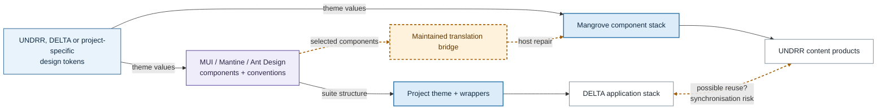
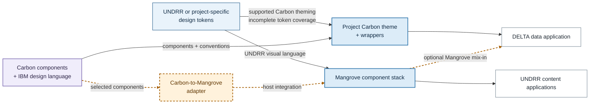
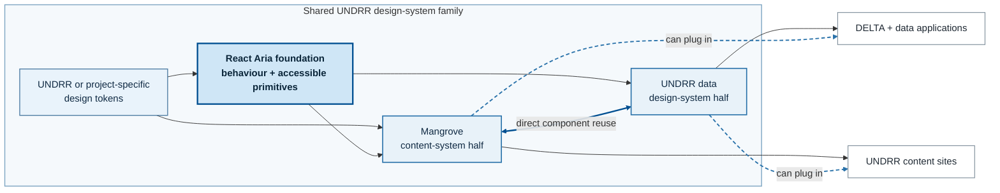

# Architecture options

UNDRR is not choosing only a component library. It is choosing an operating
model: either two product stacks connected by a maintained bridge (Types A and
B), or a coordinated family of UNDRR-owned systems sharing foundations (Type C).
All candidates cover the tested screens. The decision is who owns the component
expression, how changes propagate, and where synchronization can fail.

## What UNDRR is choosing

Any candidate can sit behind a UNDRR wrapper. The question is whether shared
UNDRR foundations become the enduring product layer or remain an adapter around
an upstream library.

## Three shapes, not five

### A. Ship-and-theme — MUI, Mantine, Ant Design

Two parallel paths use the same token mechanism but different component stacks:
Mangrove for content products and a themed suite for DELTA.

**What you get.** Upstream-maintained components and behaviour for DELTA, while
content products continue to inherit Mangrove.

**What it costs.** The two paths do not become one system merely because both are
token-driven. Moving a component or policy between them requires a maintained
translation bridge, creating the main synchronization risk.

### B. Complete branded system — IBM Carbon

Structurally the same as A, but Carbon also brings IBM's design language.

Carbon supports direct token mapping, but roughly 30% of the evaluated UNDRR
tokens were unreachable and IBM defaults still shape the result. Cross-stack
reuse therefore needs translation and does not naturally create one system.

### C. Foundational — Adobe React Aria

React Aria ships behaviour and semantics, not appearance. There is no theme layer
to configure because there is nothing to theme.

There is no upstream visual system to bridge or repair. “React Aria foundation”
means UNDRR's styled integration around the headless library. Tokens, accessible
primitives and behaviour can be governed together.

Mangrove and the data design system become two halves of one governed family.
Each keeps its product flavour, but components can move directly between them or
plug into either product family.

The diagrams now hold reuse intent constant while allowing different operating
models. Under A and B, shared packages configure and repair component systems
whose structure and design language remain upstream. Under C, UNDRR governs one
design-system family with a shared React Aria foundation and two deliberately
different product-facing halves.

## What Type C requires

Type C is *fund a design system*, not *save implementation work*. The pilot must
establish:

1. **A funded owner** for the shared foundation and both product-facing halves.
2. **Human accessibility validation** for critical journeys.
3. **A governed release and backlog model** so fixes propagate across the family.

The experiment proves that a substantial React Aria foundation can be packaged
across both hosts. It does not prove the complete component family or fund its
ongoing operation.

## The reuse and ownership result

React Aria and MUI both produced a substantial package consumed by two hosts.
The generated developer evidence below retains the exact measurements; the
architectural difference is who owns component structure and change propagation.

## What this does not settle

The pilot still needs human accessibility validation, a named operating owner,
and second-product reuse. If Type A is chosen instead, MUI's documented RTL setup
must become part of the delivery standard.
